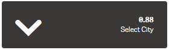
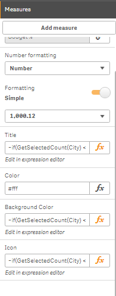
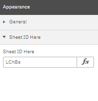

# kpi_7
Qlik Sense Basic Kpi visualization takes 1 measures with Font Awesome 5.1 supported

Only 1 Measure can be added

Custom Title, Font, Background & text Color can be added

Sheet Navigation can be used by adding the sheet id

To make a kpi <a target="_blank" href="https://www.youtube.com/playlist?list=PLYjPUKwx_Zbf6ct3AH510CVvq14caZxYi">Go to youtube</a>

